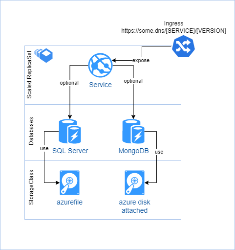

# Library of usefull HELM Templates

## web-application

a helm template that provide the following stack :

* web-application
* Ingress (optional)
* MongoDB (optional)
* Microsoft SQL Server R19 Linux (optional)
* 
  
  more details :
  https://github.com/MichaelKoch/helm/blob/main/web-application/README.md

### Status

* [x] documentation available
* [x] Test succeeded
* [ ] Security audit done

---

